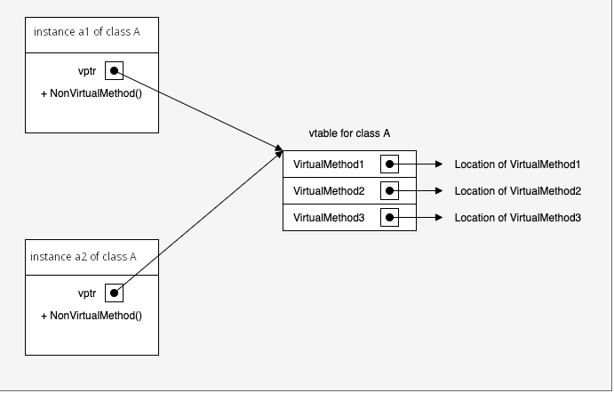

Here's info about overriding base classes; virtual functions, its internals; abstact classes.

For more examples, see `./MyInheritanceExamples/Program.cs`

## What kind of functions/properties child class does not inherit from the parent class?
Constructors and destructors. However, you can call parent's constructor explicitly:
```
class Base {
    public Base(T arg) {
        // do smth...
    }
}

class Child : Base {
    public Child(T arg) : base(arg) {}
}
``` 

## Overriding the base class

You can override some function from the base class in several ways:
```
class Base {
    public virtual void SayHello() {
        Console.WriteLine("Hey");
    }
}

// First:
class Child1 : Base {
    public override void SayHello() {
        Console.WriteLine("Hello");
    }
}

// Second:
class Child2 : Base {
    public new void SayHello() {
        Console.WriteLine("Hello");
    }
}

// Third:
class Child3 : Base {
    public virtual void SayHello() {
        Console.WriteLine("Hello");
    }
    
    // Or just (some say it won't compile but it works on my machine xD):
    public void SayHello() {
        Console.WriteLine("Hello");
    }
}
```

What's the difference between all these? If you will call only derived classes, there's literally no difference. However: 

For examples in code see `./MyInheritanceExamples/Program.cs`. 

1. `override` keyword overrides the virtual function from the base class while casting to the base class (see )
2. `new` and `virtual` **in child class** and new declaration in child class don't do this. They simple create new, unrelated to the parent class function just with the same name, whereas `virtual` and `override` functions are tied by so-called Virtual Methods Table. For more details for why does it happen see `https://pnguyen.io/posts/virtual-new-override-csharp/`

## What is Virtual Methods Table (VMT) and how it works?
(VMT is also sometimes called `vtable` or `dispatch table`)

VMT is used to determine at **run time** which method from which class in the hierarchy to call. If class has at least 1 virtual method, it will also have pointer to its VMT. This pointer will always be at the beggining of the object address (see an image below). All object instances of the same class will share the same vtable.



**How C# decides what method to call during run time is described here: `https://pnguyen.io/posts/virtual-new-override-csharp/`**